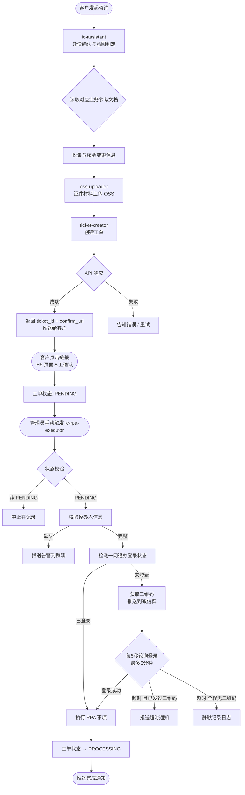
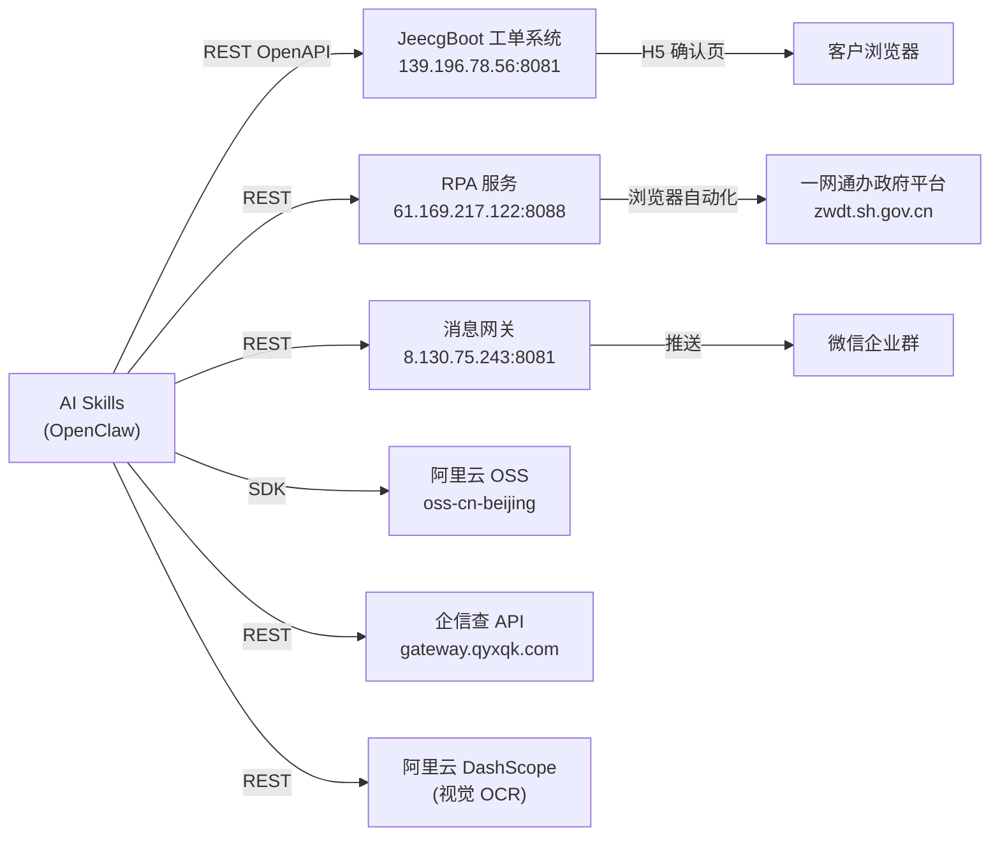

# AI Workers — 工商变更自动化平台 项目文档

> **项目路径**：`/Users/suf1234/code-spaces/edonesoft/ai-workers/skills`
> **文档版本**：v1.2  
> **更新日期**：2026-06-09

---

## 目录

1. [项目概述](#1-项目概述)
2. [整体架构](#2-整体架构)
3. [工作流全貌](#3-工作流全貌)
4. [Skill 模块详解](#4-skill-模块详解)
   - 4.1 [ic-assistant — 综合工商变更助手](#41-ic-assistant--综合工商变更助手)
   - 4.2 [ticket-creator — 工单创建](#42-ticket-creator--工单创建)
   - 4.3 [ic-rpa-executor — RPA 自动执行](#43-ic-rpa-executor--rpa-自动执行)
   - 4.4 [oss-uploader — 文件上传](#44-oss-uploader--文件上传)
   - 4.5 [recruitment-assistant — 招聘助手](#45-recruitment-assistant--招聘助手)
   - 4.6 [invoice-creator — 开票工单创建](#46-invoice-creator--开票工单创建)
5. [工单状态机](#5-工单状态机)
6. [环境变量配置](#6-环境变量配置)
7. [服务依赖关系](#7-服务依赖关系)
8. [数据结构参考](#8-数据结构参考)
9. [错误处理与安全机制](#9-错误处理与安全机制)
10. [文件目录树](#10-文件目录树)

---

## 1. 项目概述

本项目是一套基于 **OpenClaw AI Agent 平台**构建的工商变更全流程自动化系统。通过微信群聊作为交互入口，引导客户完成工商变更信息收集、工单创建、材料归档，并由 RPA 机器人自动在一网通办政府平台上完成申报操作。

**核心目标**：

| 阶段 | 描述 |
|------|------|
| 信息收集 | AI 对话引导客户提供变更信息，自动 OCR 识别证件材料 |
| 工单创建 | 将收集信息自动提交至工单系统，生成工单并返回确认链接 |
| 人工确认 | 客户点击 H5 链接在线确认工单信息 |
| RPA 执行 | 管理员触发 RPA，自动扫码登录政府平台并完成申报 |
| 状态通知 | 全程关键节点通过微信群实时推送进度消息 |

---

## 2. 整体架构

```
微信群聊 (客户)
    │
    ▼
┌─────────────────────────────────────────────────────┐
│          OpenClaw Gateway（消息路由网关）             │
│  session_key → mapping_key 映射，负责收发消息        │
└──────────────────────┬──────────────────────────────┘
                       │
                       ▼
                          │
                          ▼
           ┌──────────────────────────────┐
           │      JeecgBoot 工单系统      │
           │  bizorder OpenAPI            │
           │  状态：CONFIRM_BY_C → ...   │
           └──────────────┬───────────────┘
                          │ 管理员手动触发
                          ▼
           ┌──────────────────────────────┐
           │      ic-rpa-executor Skill   │
           │  状态校验 → 扫码登录 → RPA  │
           └──────────────┬───────────────┘
                          │
                          ▼
           ┌──────────────────────────────┐
           │      RPA 服务（一网通办）    │
           │  capital-reduction API       │
           └──────────────────────────────┘
```

---

## 3. 工作流全貌



---

## 4. Skill 模块详解

### 4.1 ic-assistant — 综合工商变更助手

**文件**：[ic-assistant/SKILL.md](file:///Users/suf1234/code-spaces/edonesoft/ai-workers/skills/ic-assistant/SKILL.md)

**脚本**：
- [unified_query.py](file:///Users/suf1234/code-spaces/edonesoft/ai-workers/skills/ic-assistant/scripts/unified_query.py) — 企业信息查询（企信查 API）
- [validate_document.py](file:///Users/suf1234/code-spaces/edonesoft/ai-workers/skills/ic-assistant/scripts/validate_document.py) — 证件 OCR 识别（DashScope 视觉模型）

**业务参考文档 (`references/`)**：
- [PERIOD.md](file:///Users/suf1234/code-spaces/edonesoft/ai-workers/skills/ic-assistant/references/PERIOD.md) — 经营期限变更逻辑
- [EQUITY.md](file:///Users/suf1234/code-spaces/edonesoft/ai-workers/skills/ic-assistant/references/EQUITY.md) — 股权变更逻辑
- [REDUCTION.md](file:///Users/suf1234/code-spaces/edonesoft/ai-workers/skills/ic-assistant/references/REDUCTION.md) — 减资变更逻辑
- [LEGAL.md](file:///Users/suf1234/code-spaces/edonesoft/ai-workers/skills/ic-assistant/references/LEGAL.md) — 法定代表人变更逻辑

**职责**：统一处理经营期限变更、股权变更、减资变更及法定代表人变更业务。根据客户意图动态加载参考文档，收集字段和证件材料，统一完成数据流闭环。

**依赖环境变量**：

| 变量 | 用途 |
|------|------|
| `QYXQK_APP_ID` / `QYXQK_SECRET` | 企信查 API 鉴权 |
| `QYXQK_FUZZY_QUERY_API` | 企业模糊查询接口 |
| `QYXQK_SHAREHOLDER_API` | 股东信息查询接口 |
| `DASHSCOPE_API_KEY` | 阿里云 DashScope OCR |
| `DASHSCOPE_VISION_MODEL` | 视觉模型名称（`qwen-vl-max`） |

---

### 4.2 ticket-creator — 工单创建

**文件**：[ticket-creator/SKILL.md](file:///Users/suf1234/code-spaces/edonesoft/ai-workers/skills/ticket-creator/SKILL.md)  
**脚本**：[ticket_creator.py](file:///Users/suf1234/code-spaces/edonesoft/ai-workers/skills/ticket-creator/scripts/ticket_creator.py)  
**API 文档**：[工商变更工单API.md](file:///Users/suf1234/code-spaces/edonesoft/ai-workers/skills/ticket-creator/工商变更工单API.md)

**职责**：将 LLM 提取的结构化变更信息归一化并提交至工单系统，返回工单 ID 和 H5 确认链接。

#### 输入参数结构

```json
{
  "sessionKey": "agent:main:dashboard:xxx",
  "workOrder": {
    "enterpriseName": "上海星辰贸易有限公司",
    "creditCode": "91310000MA002B002X",
    "matterType": "CHANGE",
    "objectType": "ENTERPRISE",
    "orderType": "BIZ_CHANGE",
    "orderStatus": "CONFIRM_BY_C"
  },
  "itemList": [
    {
      "itemName": "EQUITY",
      "beforeChange": { "shareholders": [...] },
      "afterChange": { "shareholders": [...] }
    }
  ]
}
```

#### 数据归一化处理

脚本内置以下自动转换逻辑：

| 功能 | 说明 |
|------|------|
| 中文别名映射 | "变更" → `CHANGE`，"企业" → `ENTERPRISE` 等 |
| 金额单位转换 | "500万" → `5000000`（元，整型） |
| 比例归一化 | `60%` 或 `0.60` 统一转为 `0~1` 小数 |
| 期限归一化 | "长期" → `{type: "forever"}`，日期字符串 → `{type: "fixed", date: "..."}` |
| 股东文本解析 | 自然语言股东描述自动提取为结构化 `shareholders` 数组 |
| sessionKey 注入 | 自动将 `sessionKey` 写入 `wechatMappingKey` 字段 |
| 审计字段过滤 | 自动过滤 `id`、`createTime` 等后端填充字段 |

#### 返回值结构（成功）

```json
{
  "success": true,
  "result": "添加成功！id=2062738766116786178",
  "ticket_id": "2062738766116786178",
  "confirm_url": "http://139.196.78.56:8000/bizorder/h5?id=2062738766116786178"
}
```

#### 依赖环境变量

| 变量 | 必填 | 说明 |
|------|------|------|
| `TICKET_CREATOR_BASE_URL` | ✅ | 工单系统 API Base，如 `http://139.196.78.56:8081/jeecg-boot` |
| `TICKET_CREATOR_OPEN_TOKEN` | ✅ | 静态鉴权 Token（`X-Open-Token` 请求头） |
| `TICKET_CREATOR_H5_BASE_URL` | ❌ | H5 确认页 Base（默认回退用 `TICKET_CREATOR_BASE_URL`） |

---

### 4.6 invoice-creator — 开票工单创建

**文件**：[invoice-creator/SKILL.md](file:///Users/suf1234/code-spaces/edonesoft/ai-workers/skills/invoice-creator/SKILL.md)  
**脚本**：[invoice_creator.py](file:///Users/suf1234/code-spaces/edonesoft/ai-workers/skills/invoice-creator/scripts/invoice_creator.py)、[tax_query.py](file:///Users/suf1234/code-spaces/edonesoft/ai-workers/skills/ic-assistant/scripts/tax_query.py)  
**API 参考**：[开票工单对接参考文档.md](file:///Users/suf1234/code-spaces/edonesoft/ai-workers/skills/temp/开票工单对接参考文档.md)

**职责**：将 LLM 提取并经客户确认的开票信息归一化并提交至工单系统创建开票工单。

#### 输入参数结构

```json
{
  "sessionKey": "agent:main:dashboard:xxx",
  "workOrder": {
    "enterpriseName": "上海星辰贸易有限公司",
    "creditCode": "91310000MA002B002X"
  },
  "invoiceOrder": {
    "buyerName": "北京某科技有限公司",
    "buyerCreditCode": "91110108MA01XXXXX",
    "invoiceType": "BLUE_INVOICE",
    "invoiceCategory": "SPECIAL_VAT_INVOICE",
    "invoiceRemark": "项目一期开发费"
  },
  "invoiceDetailList": [
    {
      "itemName": "系统软件产品",
      "goodsServiceTaxCode": "1060301010100000000",
      "unit": "项",
      "quantity": 3,
      "amount": 10000,
      "unitPrice": 3333.3333333333333,
      "taxRate": "6%"
    }
  ]
}
```

#### 数据归一化与校验处理

| 功能 | 说明 |
|------|------|
| 发票类型别名映射 | "蓝字"、"蓝票" → `BLUE_INVOICE`，"红字"、"红冲" → `RED_INVOICE` |
| 发票类别别名映射 | "专票" → `SPECIAL_VAT_INVOICE`，"普票" → `NORMAL_INVOICE` |
| 税收编码强校验 | `goodsServiceTaxCode` 为必填项，严格校验 19 位纯数字格式 |
| 交互式税码选择 | 前置对话中使用 `tax_query.py` 检索 `/taxCategory/search` 并由客户确认选择 |
| 含税金额与单价 | `amount`（含税金额，保留最多4位小数）为必填；`unitPrice` 根据 `amount ÷ quantity` 自动计算（除不尽保留 13 位小数） |
| sessionKey 注入 | 自动将 `sessionKey` 写入 `wechatMappingKey` 字段 |
| 参数校验 | 必填字段检查（销方名称、购方名称、发票类型、发票类别、19位税码、含税金额、明细行） |

#### 返回值结构（成功）

```json
{
  "success": true,
  "result": "添加成功！id=2082323735033016330",
  "ticket_id": "2082323735033016330"
}
```

#### 依赖环境变量

| 变量 | 必填 | 说明 |
|------|------|------|
| `TICKET_CREATOR_BASE_URL` | ✅ | 复用工单系统 API Base |
| `RPA_API_KEY` | ✅ | 复用，用于 `X-Open-Token` 鉴权 |

---

### 4.3 ic-rpa-executor — RPA 自动执行

**文件**：[ic-rpa-executor/SKILL.md](file:///Users/suf1234/code-spaces/edonesoft/ai-workers/skills/ic-rpa-executor/SKILL.md)  
**脚本**：[rpa_executor.py](file:///Users/suf1234/code-spaces/edonesoft/ai-workers/skills/ic-rpa-executor/scripts/rpa_executor.py)

**触发方式**：手动触发（管理员执行）

```bash
python3 skills/ic-rpa-executor/scripts/rpa_executor.py {工单ID}
```

**核心执行步骤**：

#### Step 1：校验工单状态
- 调用工单查询 API 获取详情
- 若状态不是 `PENDING`（待提交）则直接中止，不做任何操作

#### Step 2：校验经办人信息
验证以下字段必须完整：

| 字段 | 说明 |
|------|------|
| `agentName` | 经办人姓名 |
| `agentPhone` | 经办人手机号 |
| `idCardFrontUrl` | 身份证正面照片 URL |
| `idCardBackUrl` | 身份证反面照片 URL |

> 缺失时推送微信群告警，中止执行。

#### Step 3：扫码登录检测（含防护逻辑）

```
for attempt in 1..5:
    if check_login():          # 先检查是否已登录
        break
    获取二维码（超时 120s）
    if 二维码获取失败:
        等待 10s → 重试（不发消息）
    else:
        推送二维码 + 文字到微信群
        for check_round in 1..12:     # 每 5s 轮询，最长 60s
            sleep(5)
            if check_login():
                break
if 超时:
    if 期间曾发过二维码: 推送超时通知到群聊
    else: 仅记录日志，不打扰客户
```

#### Step 4：RPA 事项执行

| itemName | 处理方式 |
|----------|----------|
| `CAPITAL` | 调用 RPA 减资接口 `POST /api/v1/task/capital-reduction/start` |
| `EQUITY` | 跳过（预留，推送人工跟进提示） |
| `PERIOD` | 跳过（暂无接口，推送人工跟进提示） |

#### Step 5：工单状态流转
- 所有支持事项成功启动后，调用 transit API 将状态由 `PENDING` → `PROCESSING`
- 发送完成通知到微信群

#### 依赖环境变量

| 变量 | 说明 |
|------|------|
| `TICKET_CREATOR_BASE_URL` | 工单系统 API Base |
| `TICKET_CREATOR_OPEN_TOKEN` | 工单系统鉴权 Token |
| `RPA_BASE_URL` | RPA 服务地址，如 `http://61.169.217.122:8088` |
| `RPA_API_KEY` | RPA 服务 API Key（`X-API-Key` 请求头） |
| `GATEWAY_URL` | 消息网关地址，如 `http://8.130.75.243:8081` |
| `GATEWAY_API_TOKEN` | 网关 Bearer Token |
| `RPA_CALLBACK_URL` | RPA 完成回调地址（可选，默认 dummy） |

---

### 4.4 oss-uploader — 文件上传

**文件**：[oss-uploader/SKILL.md](file:///Users/suf1234/code-spaces/edonesoft/ai-workers/skills/oss-uploader/SKILL.md)  
**脚本**：[upload_tool.py](file:///Users/suf1234/code-spaces/edonesoft/ai-workers/skills/oss-uploader/scripts/upload_tool.py)

**职责**：将本地文件或远程 URL 文件同步上传至阿里云 OSS。

**上传规则**：
- 目标路径：`openclaw/YYYYMMDD/{filename}`
- Bucket：`aiqifu`
- Endpoint：`oss-cn-beijing.aliyuncs.com`

**依赖环境变量**：

| 变量 | 必填 | 说明 |
|------|------|------|
| `OSS_AK_ID` | ✅ | 阿里云 AccessKey ID |
| `OSS_AK_SECRET` | ✅ | 阿里云 AccessKey Secret |
| `OSS_ENDPOINT` | ❌ | 默认 `oss-cn-beijing.aliyuncs.com` |
| `OSS_BUCKET` | ❌ | 默认 `aiqifu` |

---

### 4.5 recruitment-assistant — 招聘助手

**文件**：[recruitment-assistant/SKILL.md](file:///Users/suf1234/code-spaces/edonesoft/ai-workers/skills/recruitment-assistant/SKILL.md)  
**脚本**：[recruitment_callback.py](file:///Users/suf1234/code-spaces/edonesoft/ai-workers/skills/recruitment-assistant/scripts/recruitment_callback.py)

**职责**：负责在一对一私聊中进行模版风格驱动的招聘对话。支持 JSON 格式结构化输入与输出，可通过“预设初筛问题”（含硬性与加分项）在对话中逐步引导候选人，对匹配的候选人触发简历采集与面试邀约回调。

**交互机制**：
- **输入参数**：包含岗位信息、候选人简历、聊天风格模板、预设初筛问题（硬性条件 + 加分项列表）、历史聊天记录、以及 `是否协商面试时间` 开关。
- **输出参数**：每次回复必须且仅返回标准 JSON `{ content, messageType, label, bonusPoints, totalBonusPoints }`。
- **流程控制**：
  - 硬性不符标记为 `"不匹配"` 并婉拒。
  - 候选人拒绝意向标记为 `"无意向"` 并收尾。
  - 正常简历采集完且不约面试则标记为 `"需跟进"`。
  - 加分项命中单轮 `bonusPoints` 加 5 分，`totalBonusPoints` 进行累加。

**依赖环境变量**：

| 变量 | 必填 | 说明 |
|------|------|------|
| `RECRUITMENT_API_URL` | ❌ | 招聘接口回调地址 |
| `RECRUITMENT_API_TOKEN` | ❌ | 接口 Authorization Bearer Token 凭证 |


---

### 4.6 candidate-evaluator — 岗位匹配度评估专家

**目录**：`skills/candidate-evaluator/`
- **配置文件**：
  - [AGENTS.md](file:///Users/suf1234/code-spaces/edonesoft/ai-workers/skills/candidate-evaluator/AGENTS.md) — 角色定位、打分权重指标、以及标准的 JSON 输出规范。
  - [SOUL.md](file:///Users/suf1234/code-spaces/edonesoft/ai-workers/skills/candidate-evaluator/SOUL.md) — 冷静、客观、严谨评估人设。
- **仿真测试脚本**：
  - [test_evaluator.py](file:///Users/suf1234/code-spaces/edonesoft/ai-workers/skills/candidate-evaluator/test_evaluator.py) — 用于在本地脱离 OpenClaw 整体平台时对模型打分性能与数学一致性校验的仿真测试。

**职责**：负责接收岗位信息与候选人开放简历，比对两者匹配度并给出打分及原因说明。

**打分规则（总分 100 分）**：
- **基础条件（50 分）**：学历与专业匹配（15 分）、工作年限（15 分）、期望薪资（10 分）、期望城市（10 分）。
- **软性条件（50 分）**：技能匹配度（15 分）、行业/岗位经验（15 分）、稳定性与沟通能力（20 分，其中稳定性和沟通各占 10 分）。

**输出约束**：必须且仅输出一个合法的 JSON 代码块，并在生成前严格执行数学一致性校验：基础得分 breakdown 各项之和等于 `basicScore`，软性得分 breakdown 各项之和等于 `softScore`，且 `basicScore` 与 `softScore` 之和等于 `totalScore`。

### 4.7 resume-analyzer — 简历解析与综合评分专家

**目录**：`skills/resume-analyzer/`
- **配置文件**：
  - [AGENTS.md](file:///Users/suf1234/code-spaces/edonesoft/ai-workers/skills/resume-analyzer/AGENTS.md) — 角色定位、三维度打分细则（基础、软性、附加）、标签判定规则与标准的 JSON 输出契约。
  - [SOUL.md](file:///Users/suf1234/code-spaces/edonesoft/ai-workers/skills/resume-analyzer/SOUL.md) — 客观评估与逻辑自检，保障数值和状态的解耦一致。
- **仿真测试脚本**：
  - [test_analyzer.py](file:///Users/suf1234/code-spaces/edonesoft/ai-workers/skills/resume-analyzer/test_analyzer.py) — 仿真测试脚本，提供三套对比用例（高匹配、硬性缺失低分、无意向）的自动化接口测试与数学校验。

**职责**：解析岗位信息、简历与聊天记录，客观计算各项得分并输出精准与语义关键词匹配、亮点、改进、建议及匹配标签。

**打分与标签规则**：
- **得分构成**：基础条件得分（最高 50 分） + 软性条件得分（最高 50 分） + 聊天问题附加得分（每个5分，最高 20 分），总分 `total_score = min(100, 基础 + 软性 + 附加)`。
- **标签判定（`tags`）**：输出为字符串数组，只能包含 `"无意向"`、`"不匹配"`（硬性条件不满足，或总分低于60分）、`"需跟进"`（除无意向和不匹配之外的所有匹配候选人）三种核心标签。且标签状态与得分打分解耦，即使判定为不匹配或无意向，也必须输出真实的客观数学打分值。

---

## 5. 工单状态机

```
CONFIRM_BY_C       （待客户确认 — ticket-creator 创建后默认状态）
      │
      │ 客户在 H5 页面点击确认 (confirmByCustomer)
      ▼
CONFIRM_BY_A       （待经办人确认 — 等待后台经办人关联并确认）
      │
      │ 经办人确认 (confirmByAgent)
      ▼
   PENDING          （待提交 — ic-rpa-executor 的触发条件）
      │
      │ ic-rpa-executor 执行成功
      ▼
  PROCESSING        （办理中 — RPA 已提交并处于流程流转中）
      │
      │ 后续人工办理及归档
      ▼
    DONE            （已办结）
```

> [!IMPORTANT]
> `ic-rpa-executor` 仅处理 `PENDING` 状态的工单。若状态为其他值，脚本将立即中止（无副作用）。

---

## 6. 环境变量配置

项目使用 `.env` 文件集中管理（路径：`skills/.env`）。

```ini
# ────────── OSS 文件存储 ──────────
OSS_AK_ID=...
OSS_AK_SECRET=...
OSS_ENDPOINT=oss-cn-beijing.aliyuncs.com
OSS_BUCKET=aiqifu

# ────────── 企信查 API（企业信息核验） ──────────
QYXQK_APP_ID=...
QYXQK_SECRET=...
QYXQK_FUZZY_QUERY_API=https://gateway.qyxqk.com/wdyl/openapi/fuzzy_query/
QYXQK_SHAREHOLDER_API=https://gateway.qyxqk.com/wdyl/openapi/company_stockholder_query/

# ────────── DashScope（OCR 证件识别） ──────────
DASHSCOPE_API_KEY=...
DASHSCOPE_API_BASE=https://dashscope.aliyuncs.com/compatible-mode/v1
DASHSCOPE_VISION_MODEL=qwen-vl-max

# ────────── 工单系统 ──────────
TICKET_CREATOR_BASE_URL=http://139.196.78.56:8081/jeecg-boot
TICKET_CREATOR_OPEN_TOKEN=...
TICKET_CREATOR_H5_BASE_URL=http://139.196.78.56:8000   # 可选，默认回退用 BASE_URL

# ────────── RPA 服务 & 开票工单鉴权 ──────────
RPA_BASE_URL=http://61.169.217.122:8088
RPA_API_KEY=...                                         # 同时用于 invoice-creator 的 X-Open-Token 鉴权
RPA_CALLBACK_URL=                                       # 可选

# ────────── 消息网关（微信群推送） ──────────
GATEWAY_URL=http://8.130.75.243:8081
GATEWAY_API_TOKEN=...
OPENCLAW_GATEWAY_TOKEN=...                              # OpenClaw 平台内置 Token
```

---

## 7. 服务依赖关系



---

## 8. 数据结构参考

### 8.1 工单主表 `workOrder` 字段

| 字段 | 必填 | 类型 | 说明 |
|------|------|------|------|
| `enterpriseName` | ✅ | string | 企业名称 |
| `creditCode` | ✅ | string | 统一社会信用代码（18位） |
| `matterType` | ✅ | enum | `CHANGE` / `SETUP` / `CANCEL` 等 |
| `objectType` | ❌ | enum | `ENTERPRISE`（默认）/ `INDIVIDUAL` / `COOP` 等 |
| `orderType` | ❌ | enum | `BIZ_CHANGE`（默认）/ `BIZ_SETUP` / `BIZ_CANCEL` |
| `orderStatus` | ❌ | enum | 初始默认 `CONFIRM_BY_C` |
| `wechatMappingKey` | ❌ | string | 微信消息路由键（由 `sessionKey` 自动注入） |

### 8.2 事项明细 `itemList[]` 字段

| 字段 | 必填 | 说明 |
|------|------|------|
| `itemName` | ✅ | 事项代码：`NAME` / `LEGAL` / `CAPITAL` / `SCOPE` / `ADDR` / `PERIOD` / `EQUITY` |
| `beforeChange` | ✅ | 变更前 JSON（结构因 itemName 而异） |
| `afterChange` | ✅ | 变更后 JSON（结构因 itemName 而异） |

### 8.3 各事项 JSON 结构

| itemName | JSON 结构示例 |
|----------|-------------|
| `NAME` | `{"name": "上海星辰贸易有限公司"}` |
| `LEGAL` | beforeChange: `{"name": "张三"}`<br>afterChange: `{"name": "李四", "phone": "13800138000", "idCardFrontUrl": "https://...", "idCardBackUrl": "https://..."}` |
| `SCOPE` | `{"scope": "计算机软件开发；技术咨询。"}` |
| `ADDR` | `{"address": "上海市浦东新区..."}` |
| `PERIOD` | `{"type": "fixed", "date": "2035-12-31"}` 或 `{"type": "forever"}` |
| `CAPITAL` | `{"amount": 5000000, "currency": "CNY", "shareholders": [...]}` |
| `EQUITY` | `{"shareholders": [{"name":"王五","amount":2550000,"ratio":0.51,"certType":"ID_CARD","certNumber":"...","certFrontUrl":"...","certBackUrl":"..."}]}` |

### 8.4 经办人 `agent` 字段（工单系统内）

| 字段 | 说明 |
|------|------|
| `agentName` | 经办人姓名 |
| `agentPhone` | 手机号 |
| `agentIdCard` | 身份证号（可选） |
| `idCardFrontUrl` | 身份证正面 OSS URL |
| `idCardBackUrl` | 身份证反面 OSS URL |

> [!NOTE]
> 经办人信息由后台管理端手动录入并关联至工单，开放接口不支持写入经办人数据。

---

## 9. 错误处理与安全机制

### 微信消息发送策略

| 场景 | 行为 |
|------|------|
| 二维码生成失败 | **不发送**任何微信消息，仅写日志，等待 10s 后重试 |
| 所有二维码尝试均失败 | 静默退出，仅写日志，不打扰客户 |
| 成功发过二维码但最终超时 | 发送超时告警（❌）到群聊 |
| 经办人信息缺失 | 发送告警（❌）到管理员群，指明缺失字段 |
| 部分事项不支持 RPA | 发送警告（⚠️）到群聊，提示人工跟进 |
| RPA 触发全部失败 | 返回失败 JSON，不更改工单状态 |

### 工单状态幂等保护

- `ic-rpa-executor` 每次执行前强制校验状态必须为 `PENDING`
- 非 `PENDING` 状态直接返回成功退出（防止重复触发）

### Token 与鉴权

- 工单系统使用静态 `X-Open-Token` Header 鉴权
- RPA 服务使用 `X-API-Key` Header 鉴权
- Gateway 使用 `Bearer` Token 鉴权
- 所有 Token 均存储在 `.env` 文件，不硬编码在源码中

> [!CAUTION]
> `.env` 文件包含所有生产环境敏感凭证，请确保其已在 `.gitignore` 中排除，不得提交至代码仓库。

---

## 10. 文件目录树

```
skills/
├── .env                              # 环境变量（所有服务凭证）
│
├── ic-assistant/
│   ├── SKILL.md                      # 综合工商变更助手主控路由
│   ├── references/                   # 业务逻辑参考文档
│   │   ├── PERIOD.md
│   │   ├── EQUITY.md
│   │   ├── REDUCTION.md
│   │   └── LEGAL.md
│   └── scripts/                      # 公共脚本
│       ├── unified_query.py
│       └── validate_document.py
│
├── ticket-creator/
│   ├── SKILL.md                      # 工单创建 Skill 定义
│   ├── scripts/
│   │   └── ticket_creator.py         # 工单创建脚本
│   └── 工商变更工单API.md             # JeecgBoot 开放接口参考文档 v2.3
│
├── invoice-creator/
│   ├── SKILL.md                      # 开票工单创建 Skill 定义
│   └── scripts/
│       └── invoice_creator.py        # 开票工单创建脚本（含税收编码自动搜索）
│
├── ic-rpa-executor/
│   ├── SKILL.md                      # RPA 执行 Skill 定义
│   └── scripts/
│       └── rpa_executor.py           # RPA 自动化执行主脚本
│
├── oss-uploader/
│   ├── SKILL.md                      # OSS 上传 Skill 定义
│   └── scripts/
│       └── upload_tool.py            # 文件上传工具
│
└── recruitment-assistant/
    ├── SKILL.md                      # 招聘助手 Skill 定义
    └── scripts/
        └── recruitment_callback.py   # 招聘助手回调接口脚本
│
└── candidate-evaluator/
    ├── AGENTS.md                     # 评估专家核心规则 Prompt
    ├── SOUL.md                       # 评估专家评估心智 Prompt
    └── test_evaluator.py             # 仿真测试脚本
│
└── resume-analyzer/
    ├── AGENTS.md                     # 综合评分专家规则 Prompt
    ├── SOUL.md                       # 综合评分客观与自检 Prompt
    └── test_analyzer.py              # 仿真测试脚本
```
