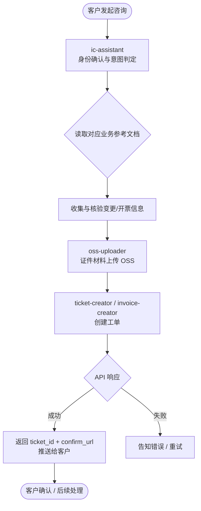
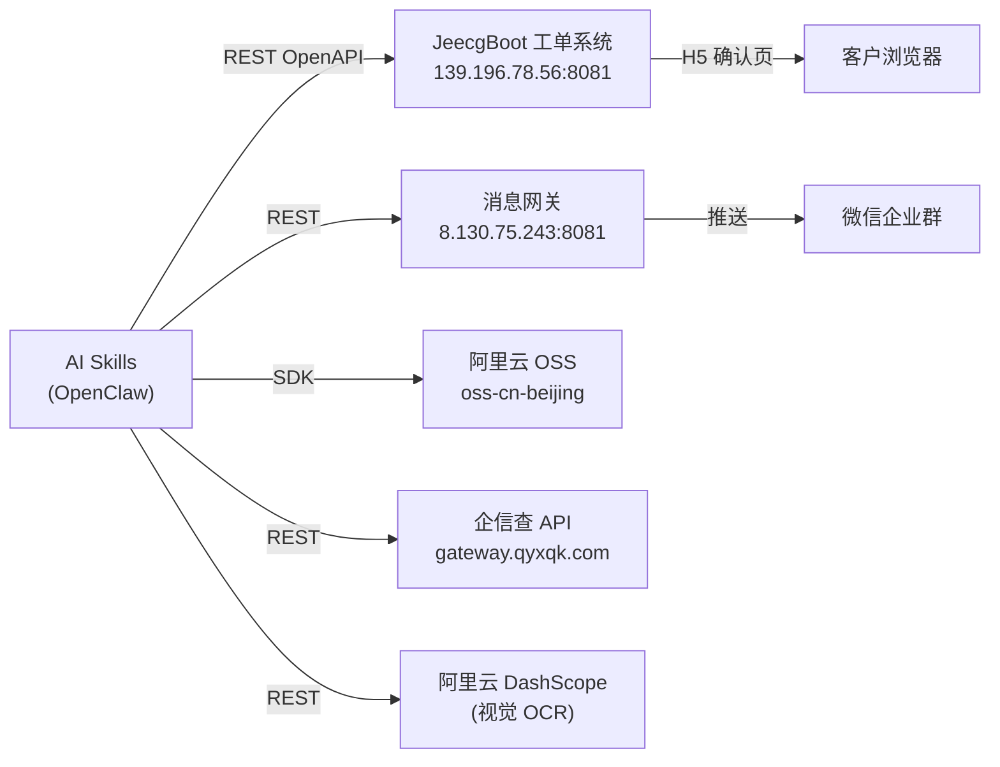

# AI Workers — 工商变更与招聘自动化平台 项目文档

> **项目路径**：`/Users/suf1234/code-spaces/edonesoft/ai-workers/skills`
> **文档版本**：v2.0  
> **更新日期**：2026-08-10

---

## 目录

1. [项目概述](#1-项目概述)
2. [整体架构](#2-整体架构)
3. [工作流全貌](#3-工作流全貌)
4. [智能体与 Skill 模块详解](#4-智能体与-skill-模块详解)
   - 4.1 [enterprise-cs — 企业客服智能体](#41-enterprise-cs--企业客服智能体)
     - 4.1.1 [ic-assistant — 综合工商变更助手](#411-ic-assistant--综合工商变更助手)
     - 4.1.2 [ticket-creator — 工单创建](#412-ticket-creator--工单创建)
     - 4.1.3 [invoice-creator — 开票工单创建](#413-invoice-creator--开票工单创建)
     - 4.1.4 [oss-uploader — 文件上传](#414-oss-uploader--文件上传)
   - 4.2 [hr-assistant — 招聘/HR 智能体](#42-hr-assistant--招聘hr-智能体)
     - 4.2.1 [recruitment-assistant — 招聘助手](#421-recruitment-assistant--招聘助手)
   - 4.3 [candidate-evaluator — 岗位匹配度评估专家 (独立智能体)](#43-candidate-evaluator--岗位匹配度评估专家-独立智能体)
   - 4.4 [resume-analyzer — 简历解析与综合评分专家 (独立智能体)](#44-resume-analyzer--简历解析与综合评分专家-独立智能体)
5. [工单状态机](#5-工单状态机)
6. [环境变量配置](#6-环境变量配置)
7. [服务依赖关系](#7-服务依赖关系)
8. [数据结构参考](#8-数据结构参考)
9. [错误处理与安全机制](#9-错误处理与安全机制)
10. [文件目录树](#10-文件目录树)

---

## 1. 项目概述

本项目是一套基于 **OpenClaw AI Agent 平台**构建的智能体系统。采用多智能体分层架构，包含企业客服智能体（`enterprise-cs`）、招聘/HR 智能体（`hr-assistant`）及独立评估智能体。通过微信群聊及各类交互入口，引导客户完成工商变更信息收集、发票开票工单创建、材料归档与招聘初筛全流程。

**核心目标**：

| 智能体/模块 | 描述 |
|------|------|
| enterprise-cs | AI 对话引导客户提供工商变更/发票开票信息，自动 OCR 识别证件材料并提交工单 |
| hr-assistant | 人性化 HR 对话进行职位初筛、简历索要及面试协商流转 |
| candidate-evaluator | 岗位匹配度精准评估打分 |
| resume-analyzer | 简历解析与综合多维度打分评分 |

---

## 2. 整体架构

```
微信群聊 / 客户端 (用户)
    │
    ▼
┌─────────────────────────────────────────────────────┐
│          OpenClaw Gateway（消息路由网关）             │
│  session_key → mapping_key 映射，负责收发消息        │
└──────────────────────┬──────────────────────────────┘
                       │
                       ├─────────────────────────────────────┐
                       ▼                                     ▼
        ┌──────────────────────────────┐     ┌──────────────────────────────┐
        │  enterprise-cs (企业客服 Agent)│     │   hr-assistant (HR Agent)    │
        │  AGENTS.md / SOUL.md         │     │   AGENTS.md / SOUL.md        │
        └──────────────┬───────────────┘     └──────────────┬───────────────┘
                       │                                     │
                       ▼                                     ▼
        ┌──────────────────────────────┐     ┌──────────────────────────────┐
        │  enterprise-cs/skills/       │     │   hr-assistant/skills/       │
        │  • ic-assistant              │     │   • recruitment-assistant    │
        │  • invoice-creator           │     └──────────────────────────────┘
        │  • ticket-creator            │
        │  • oss-uploader              │
        └──────────────┬───────────────┘
                       │
                       ▼
        ┌──────────────────────────────┐
        │      JeecgBoot 工单系统      │
        │  bizorder OpenAPI            │
        └──────────────────────────────┘
```

---

## 3. 工作流全貌



---

## 4. 智能体与 Skill 模块详解

### 4.1 enterprise-cs — 企业客服智能体

**路径**：`enterprise-cs/`
- [AGENTS.md](file:///Users/suf1234/code-spaces/edonesoft/ai-workers/skills/enterprise-cs/AGENTS.md) — 角色定位、服务范围与安全红线
- [SOUL.md](file:///Users/suf1234/code-spaces/edonesoft/ai-workers/skills/enterprise-cs/SOUL.md) — 人设风格 Constraint

#### 4.1.1 ic-assistant — 综合工商变更助手

**文件**：[ic-assistant/SKILL.md](file:///Users/suf1234/code-spaces/edonesoft/ai-workers/skills/enterprise-cs/skills/ic-assistant/SKILL.md)

**脚本**：
- [unified_query.py](file:///Users/suf1234/code-spaces/edonesoft/ai-workers/skills/enterprise-cs/skills/ic-assistant/scripts/unified_query.py) — 企业信息查询（企信查 API）
- [validate_document.py](file:///Users/suf1234/code-spaces/edonesoft/ai-workers/skills/enterprise-cs/skills/ic-assistant/scripts/validate_document.py) — 证件 OCR 识别（DashScope 视觉模型）
- [tax_query.py](file:///Users/suf1234/code-spaces/edonesoft/ai-workers/skills/enterprise-cs/skills/ic-assistant/scripts/tax_query.py) — 增值税税收分类编码检索

**业务逻辑参考文档**：
- [PERIOD.md](file:///Users/suf1234/code-spaces/edonesoft/ai-workers/skills/enterprise-cs/skills/ic-assistant/references/PERIOD.md) — 经营期限变更逻辑
- [EQUITY.md](file:///Users/suf1234/code-spaces/edonesoft/ai-workers/skills/enterprise-cs/skills/ic-assistant/references/EQUITY.md) — 股权变更逻辑
- [REDUCTION.md](file:///Users/suf1234/code-spaces/edonesoft/ai-workers/skills/enterprise-cs/skills/ic-assistant/references/REDUCTION.md) — 减资变更逻辑
- [LEGAL.md](file:///Users/suf1234/code-spaces/edonesoft/ai-workers/skills/enterprise-cs/skills/ic-assistant/references/LEGAL.md) — 法定代表人变更逻辑
- [INVOICE.md](file:///Users/suf1234/code-spaces/edonesoft/ai-workers/skills/enterprise-cs/skills/ic-assistant/references/INVOICE.md) — 发票开具逻辑

#### 4.1.2 ticket-creator — 工单创建

**文件**：[ticket-creator/SKILL.md](file:///Users/suf1234/code-spaces/edonesoft/ai-workers/skills/enterprise-cs/skills/ticket-creator/SKILL.md)  
**脚本**：[ticket_creator.py](file:///Users/suf1234/code-spaces/edonesoft/ai-workers/skills/enterprise-cs/skills/ticket-creator/scripts/ticket_creator.py)  
**API 文档**：[工商变更工单API.md](file:///Users/suf1234/code-spaces/edonesoft/ai-workers/skills/enterprise-cs/skills/ticket-creator/工商变更工单API.md)

#### 4.1.3 invoice-creator — 开票工单创建

**文件**：[invoice-creator/SKILL.md](file:///Users/suf1234/code-spaces/edonesoft/ai-workers/skills/enterprise-cs/skills/invoice-creator/SKILL.md)  
**脚本**：[invoice_creator.py](file:///Users/suf1234/code-spaces/edonesoft/ai-workers/skills/enterprise-cs/skills/invoice-creator/scripts/invoice_creator.py)  

#### 4.1.4 oss-uploader — 文件上传

**文件**：[oss-uploader/SKILL.md](file:///Users/suf1234/code-spaces/edonesoft/ai-workers/skills/enterprise-cs/skills/oss-uploader/SKILL.md)  
**脚本**：[upload_tool.py](file:///Users/suf1234/code-spaces/edonesoft/ai-workers/skills/enterprise-cs/skills/oss-uploader/scripts/upload_tool.py)

---

### 4.2 hr-assistant — 招聘/HR 智能体

**路径**：`hr-assistant/`
- [AGENTS.md](file:///Users/suf1234/code-spaces/edonesoft/ai-workers/skills/hr-assistant/AGENTS.md) — 角色定位与沟通红线
- [SOUL.md](file:///Users/suf1234/code-spaces/edonesoft/ai-workers/skills/hr-assistant/SOUL.md) — 拟人化沟通 Constraint

#### 4.2.1 recruitment-assistant — 招聘助手

**文件**：[recruitment-assistant/SKILL.md](file:///Users/suf1234/code-spaces/edonesoft/ai-workers/skills/hr-assistant/skills/recruitment-assistant/SKILL.md)  
**脚本**：[recruitment_callback.py](file:///Users/suf1234/code-spaces/edonesoft/ai-workers/skills/hr-assistant/skills/recruitment-assistant/scripts/recruitment_callback.py)

---

### 4.3 candidate-evaluator — 岗位匹配度评估专家 (独立智能体)

**目录**：`candidate-evaluator/`
- [AGENTS.md](file:///Users/suf1234/code-spaces/edonesoft/ai-workers/skills/candidate-evaluator/AGENTS.md) — 角色定位、打分权重指标与 JSON 输出规范。
- [SOUL.md](file:///Users/suf1234/code-spaces/edonesoft/ai-workers/skills/candidate-evaluator/SOUL.md) — 冷静、客观、严谨评估人设。
- [test_evaluator.py](file:///Users/suf1234/code-spaces/edonesoft/ai-workers/skills/candidate-evaluator/test_evaluator.py) — 仿真打分校验测试脚本。

---

### 4.4 resume-analyzer — 简历解析与综合评分专家 (独立智能体)

**目录**：`resume-analyzer/`
- [AGENTS.md](file:///Users/suf1234/code-spaces/edonesoft/ai-workers/skills/resume-analyzer/AGENTS.md) — 角色定位、三维度打分细则与输出契约。
- [SOUL.md](file:///Users/suf1234/code-spaces/edonesoft/ai-workers/skills/resume-analyzer/SOUL.md) — 客观评估与逻辑自检。
- [test_analyzer.py](file:///Users/suf1234/code-spaces/edonesoft/ai-workers/skills/resume-analyzer/test_analyzer.py) — 仿真测试脚本。

---

## 5. 工单状态机

```
CONFIRM_BY_C       （待客户确认 — ticket-creator 创建后默认状态）
      │
      │ 客户在 H5 页面点击确认 (confirmByCustomer)
      ▼
CONFIRM_BY_A       （待经办人确认 — 等待后台经办人关联并确认）
      │
      │ 经办人确认 (confirmByAgent)
      ▼
   PENDING          （待提交）
      │
      ▼
  PROCESSING        （办理中）
      │
      ▼
    DONE            （已办结）
```

---

## 6. 环境变量配置

项目使用 `.env` 文件集中管理（路径：`.env`）。

```ini
# ────────── OSS 文件存储 ──────────
OSS_AK_ID=...
OSS_AK_SECRET=...
OSS_ENDPOINT=oss-cn-beijing.aliyuncs.com
OSS_BUCKET=aiqifu

# ────────── 企信查 API（企业信息核验） ──────────
QYXQK_APP_ID=...
QYXQK_SECRET=...
QYXQK_FUZZY_QUERY_API=https://gateway.qyxqk.com/wdyl/openapi/fuzzy_query/
QYXQK_SHAREHOLDER_API=https://gateway.qyxqk.com/wdyl/openapi/company_stockholder_query/

# ────────── DashScope（OCR 证件识别） ──────────
DASHSCOPE_API_KEY=...
DASHSCOPE_API_BASE=https://dashscope.aliyuncs.com/compatible-mode/v1
DASHSCOPE_VISION_MODEL=qwen-vl-max

# ────────── 工单系统 ──────────
TICKET_CREATOR_BASE_URL=http://139.196.78.56:8081/jeecg-boot
TICKET_CREATOR_OPEN_TOKEN=...
TICKET_CREATOR_H5_BASE_URL=http://139.196.78.56:8000   # 可选，默认回退用 BASE_URL

# ────────── RPA 服务 & 开票工单鉴权 ──────────
RPA_BASE_URL=http://61.169.217.122:8088
RPA_API_KEY=...                                         # 同时用于 invoice-creator 的 X-Open-Token 鉴权
RPA_CALLBACK_URL=                                       # 可选

# ────────── 消息网关（微信群推送） ──────────
GATEWAY_URL=http://8.130.75.243:8081
GATEWAY_API_TOKEN=...
OPENCLAW_GATEWAY_TOKEN=...                              # OpenClaw 平台内置 Token
```

---

## 7. 服务依赖关系



---

## 8. 数据结构参考

### 8.1 工单主表 `workOrder` 字段

| 字段 | 必填 | 类型 | 说明 |
|------|------|------|------|
| `enterpriseName` | ✅ | string | 企业名称 |
| `creditCode` | ✅ | string | 统一社会信用代码（18位） |
| `matterType` | ✅ | enum | `CHANGE` / `SETUP` / `CANCEL` 等 |
| `objectType` | ❌ | enum | `ENTERPRISE`（默认）/ `INDIVIDUAL` / `COOP` 等 |
| `orderType` | ❌ | enum | `BIZ_CHANGE`（默认）/ `BIZ_SETUP` / `BIZ_CANCEL` |
| `orderStatus` | ❌ | enum | 初始默认 `CONFIRM_BY_C` |
| `wechatMappingKey` | ❌ | string | 微信消息路由键（由 `sessionKey` 自动注入） |

---

## 9. 错误处理与安全机制

- 工单系统使用静态 `X-Open-Token` Header 鉴权
- RPA 服务使用 `X-API-Key` Header 鉴权
- Gateway 使用 `Bearer` Token 鉴权
- 所有 Token 均存储在 `.env` 文件，不硬编码在源码中

> [!CAUTION]
> `.env` 文件包含所有生产环境敏感凭证，请确保其已在 `.gitignore` 中排除，不得提交至代码仓库。

---

## 10. 文件目录树

```
skills/
├── .env                              # 环境变量（所有服务凭证）
│
├── enterprise-cs/                    # 【智能体 1】企业客服智能体
│   ├── AGENTS.md                     # 角色定位与服务红线 Prompt
│   ├── SOUL.md                       # 人设 Constraint Prompt
│   └── skills/                       # 企业客服使用的 Skill 库
│       ├── ic-assistant/             # 综合工商变更与开票前置助手 Skill
│       │   ├── SKILL.md
│       │   ├── references/
│       │   └── scripts/
│       ├── ticket-creator/           # 工商变更工单创建 Skill
│       │   ├── SKILL.md
│       │   ├── scripts/
│       │   └── 工商变更工单API.md
│       ├── invoice-creator/          # 开票工单创建 Skill
│       │   ├── SKILL.md
│       │   └── scripts/
│       └── oss-uploader/             # OSS 文件上传 Skill
│           ├── SKILL.md
│           └── scripts/
│
├── hr-assistant/                      # 【智能体 2】招聘/HR 智能体
│   ├── AGENTS.md                     # 角色定位与沟通红线 Prompt
│   ├── SOUL.md                       # 拟人化沟通 Prompt
│   └── skills/                       # 招聘助手 Skill 库
│       └── recruitment-assistant/    # 招聘流程交互助手 Skill
│           ├── SKILL.md
│           └── scripts/
│
├── candidate-evaluator/               # 【智能体 3】候选人匹配度评估专家 (独立 Agent)
│   ├── AGENTS.md
│   ├── SOUL.md
│   └── test_evaluator.py
│
└── resume-analyzer/                  # 【智能体 4】简历解析与综合评分专家 (独立 Agent)
    ├── AGENTS.md
    ├── SOUL.md
    └── test_analyzer.py
```
